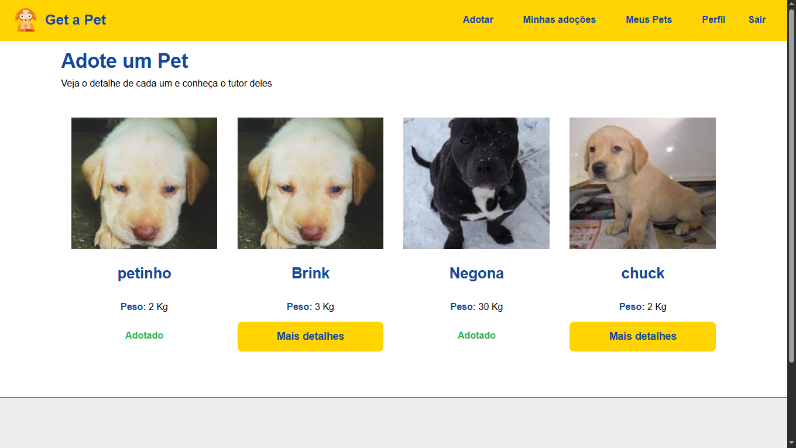
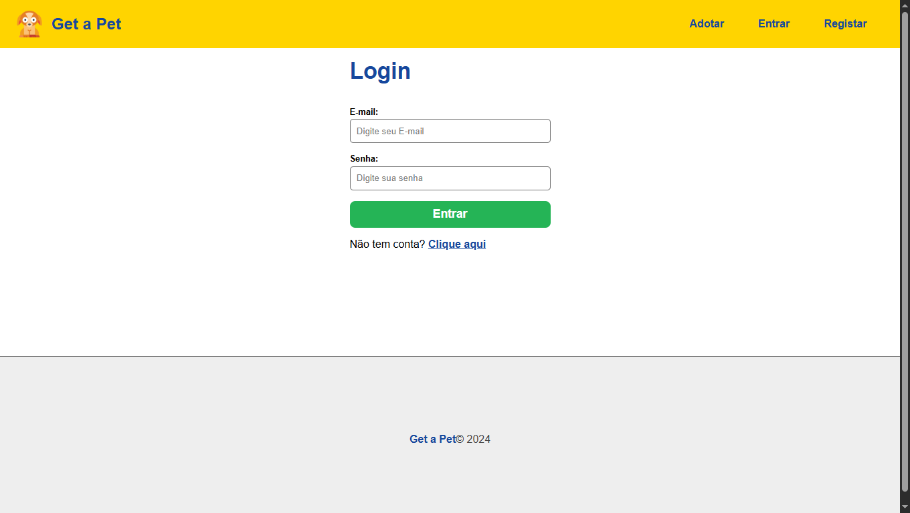
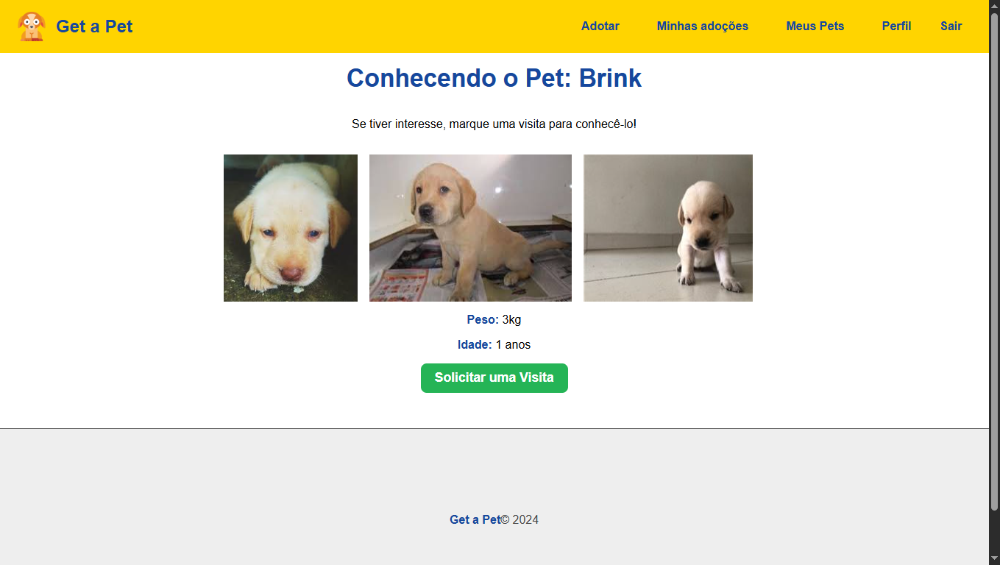

# 🐾 Get-a-pet

> Sistema completo de adoção de animais, com API RESTful documentada via Swagger e frontend em React.
> 

---

## 📝 Sumário

- [📌 Visão Geral](https://www.notion.so/28252582ff7d80e99b5fc09a5b132b87?pvs=21)
- [✨ Funcionalidades](https://www.notion.so/28252582ff7d80e99b5fc09a5b132b87?pvs=21)
- [🛠️ Tecnologias Utilizadas](https://www.notion.so/28252582ff7d80e99b5fc09a5b132b87?pvs=21)
- [📂 Arquitetura / Estrutura do Projeto](https://www.notion.so/28252582ff7d80e99b5fc09a5b132b87?pvs=21)
- [⚙️ Instalação & Execução](https://www.notion.so/28252582ff7d80e99b5fc09a5b132b87?pvs=21)
- [🔑 Configuração / Variáveis de Ambiente](https://www.notion.so/28252582ff7d80e99b5fc09a5b132b87?pvs=21)
- [📘 Documentação da API (Swagger)](https://www.notion.so/28252582ff7d80e99b5fc09a5b132b87?pvs=21)
- [🌐 Endpoints / Rotas](https://www.notion.so/28252582ff7d80e99b5fc09a5b132b87?pvs=21)
- [▶️ Uso (Exemplos)](https://www.notion.so/28252582ff7d80e99b5fc09a5b132b87?pvs=21)
- [🖼️ Screenshots / Imagens](https://www.notion.so/28252582ff7d80e99b5fc09a5b132b87?pvs=21)
- [🤝 Contribuições](https://www.notion.so/28252582ff7d80e99b5fc09a5b132b87?pvs=21)
- [📄 Licença](https://www.notion.so/28252582ff7d80e99b5fc09a5b132b87?pvs=21)
- [📬 Contato](https://www.notion.so/28252582ff7d80e99b5fc09a5b132b87?pvs=21)

---

## 📌 Visão Geral

O **Get-a-pet** é uma aplicação **full-stack** que conecta pessoas interessadas em **adotar animais** a donos e ONGs que possuem pets disponíveis.

- **Backend:** API RESTful construída com **Node.js + Express**, padrão **MVC**, usando **MongoDB (Mongoose)** e **JWT** para autenticação.
- **Frontend:** SPA em **React**, consumindo a API com **Axios**.
- Toda a API é **documentada com Swagger**, permitindo testar rotas diretamente no navegador.

---

## ✨ Funcionalidades

- 🔐 Autenticação e autorização de usuários (**JWT**)
- 🐕 Cadastro, listagem, edição e exclusão de pets (**CRUD**)
- 📤 Upload de imagens de pets
- 📃 Listagem de pets disponíveis para adoção
- ✅ Sistema de pedidos de adoção e aprovação/rejeição
- 📊 Dashboard do usuário para gerenciar pets e pedidos
- 📑 **Swagger** para documentação interativa da API

---

## 🛠️ Tecnologias Utilizadas

### 🔹 Backend

- [Node.js](https://nodejs.org/)
- [Express](https://expressjs.com/)
- Arquitetura **MVC**
- **API RESTful**
- [MongoDB](https://www.mongodb.com/) + [Mongoose](https://mongoosejs.com/)
- Autenticação com **JWT**
- [Swagger UI](https://swagger.io/tools/swagger-ui/) para documentação da API

### 🔹 Frontend

- [React](https://react.dev/)
- [Axios](https://axios-http.com/)
- Context API, Hooks e Utils
- HTML5 / CSS3 / JavaScript (ES6+)

### 🔹 Outros

- [Multer](https://www.npmjs.com/package/multer) para upload de arquivos
- Git & GitHub para versionamento

---

## 📂 Arquitetura / Estrutura do Projeto

### 🟩 Backend

```bash
backend/
├── controllers/      # Lógica das rotas (ex.: UserController, PetController)
├── db/               # Conexão com o banco de dados (MongoDB)
├── helpers/          # Funções auxiliares (JWT, upload de imagens)
├── models/           # Schemas do Mongoose (User, Pet)
├── public/           # Arquivos estáticos
├── routes/           # Definição de rotas da API
├── swagger/          # Configurações e documentação Swagger
├── index.js          # Ponto de entrada do servidor
└── package.json

```

---

### 🟦 Frontend

```bash
frontend/
├── public/                   # Arquivos estáticos do React
└── src/
    ├── assets/               # Imagens, ícones, etc.
    ├── components/           # Componentes reutilizáveis do React
    ├── context/              # Context API para estados globais
    ├── hooks/                # Hooks customizados
    ├── utils/                # Funções utilitárias
    ├── App.js                # Componente raiz
    ├── index.css             # Estilos globais
    └── index.js              # Ponto de entrada do React
├── .env.local                # Variáveis de ambiente do frontend
└── package.json

```

---

## ⚙️ Instalação & Execução

### 🔧 Pré-requisitos

- [Node.js](https://nodejs.org/) **>= 16.x**
- npm ou yarn
- [MongoDB](https://www.mongodb.com/) (local ou em nuvem – ex.: MongoDB Atlas)

---

### 🚀 Passo a passo

1. **Clone o repositório:**

```bash
git clone <https://github.com/deividev5/Get-a-pet.git>
cd Get-a-pet

```

1. **Instale as dependências do backend:**

```bash
cd backend
npm install

```

1. **Instale as dependências do frontend:**

```bash
cd ../frontend
npm install

```

1. **Configure as variáveis de ambiente** (veja abaixo).
2. **Inicie o backend:**

```bash
cd ../backend
npm start

```

1. **Inicie o frontend:**

```bash
cd ../frontend
npm start

```

🌐 **Acessos padrão:**

- Backend: [http://localhost:5000](http://localhost:5000/)
- Frontend: [http://localhost:3000](http://localhost:3000/)
- Swagger: http://localhost:5000/api-docs

---

## 🔑 Configuração / Variáveis de Ambiente

📁 **Frontend (.env.local):**

```bash
REACT_APP_API_URL=http://localhost:5000/

```

---

## 📘 Documentação da API (Swagger)

Acesse o **Swagger UI** no navegador:
👉 http://localhost:5000/api-docs

Permite visualizar **todas as rotas** e **testá-las** diretamente.

---

## 🖼️ Screenshots / Imagens

📷 **Espaço reservado para algumas imagens do sistema:**

- Tela inicial
 
- Tela de Login
  
- Tela de perfil
  
- Tela detalhe do Pet
    

---

## 📬 Contato

- 👤 Autor: **Deivisson Gonçalves**
- 💻 GitHub: [@deividev5](https://github.com/deividev5)
- 📧 Email: [deivissondevcontato@gmail.com](mailto:deivissondevcontato@gmail.com)

---

🚀 **Get-a-pet** — conectando pessoas e pets que precisam de um lar ❤️
